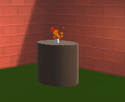

Particle Systems use lots of small images to create graphical effects that make a 3D world come alive. 

Click in the Inspector window and choose **Effects** > **Particle System** to add a particle effect to your world. You can also add a Particle System as a child of another GameObject if that makes more sense. 

There are lots of settings you can experiment with to get different particle effects. 

Try adjusting these settings:
+ **Start Color**: Click on the colour to choose the colour for your particles. 
+ **Start Speed**: Control how fast your particles move. 
+ **Start Size**: Control the size of each particle. 
+ **Gravity Modifier**: Set to a positive number if you want your particles to fall to the ground. 
+ **Shape**: Controls the shape that particles appear from. The default is a Cone shape but it might make more sense for your particles to appear in a Sphere or a Cube area. 
+ **Max Particles**: The maximum number of particles that will be active at the same time. 

These settings create a snow effect. The 'Start Size' uses the option 'Random Between Two Constants'.

{:width="350px"}
