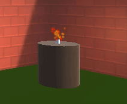
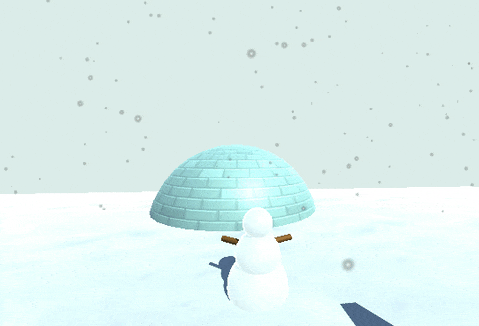

Les Particles Systems utilisent de nombreuses petites images pour créer des effets graphiques qui donnent vie à un monde en 3D.

Clique dans la fenêtre Inspector et choisis **Effects** > **Particle Systems** pour ajouter un effet de particules à ton monde. Tu peux aussi ajouter un Particle System en tant qu'enfant d'un autre GameObject, si cela a plus de sens.

Il y a beaucoup de paramètres avec lesquels tu peux expérimenter pour obtenir différents effets de particules.

Essaie de régler ces paramètres :
+ **Start Color** : clique sur la couleur pour choisir la couleur de tes particules.
+ **Start Speed**: contrôle la vitesse à laquelle tes particules se déplacent.
+ **Start Size**: contrôle la taille de chaque particule.
+ **Gravity Modifier** : définis un nombre positif si tu veux que tes particules tombent sur le sol.
+ **Shape**: contrôle la forme à partir de laquelle les particules apparaissent. La forme par défaut est celle d'un cône, mais il peut être plus logique que tes particules apparaissent dans une sphère ou un cube.
+ **Max Particles** : le nombre maximum de particules qui seront actives en même temps.

Ces paramètres créent un effet de neige. La « Start Size » utilise l'option « Random Between Two Constants ».

{:width="350px"}
